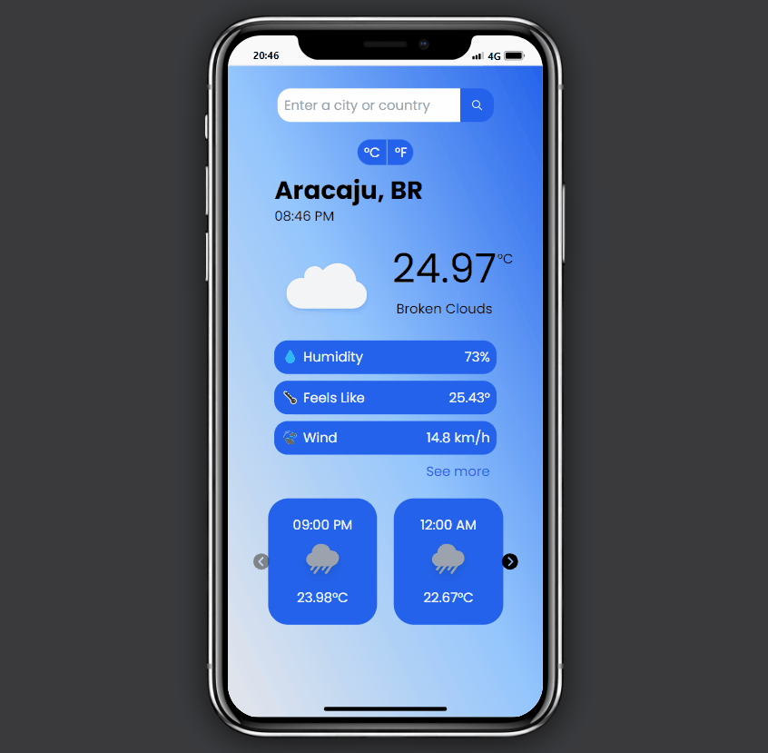
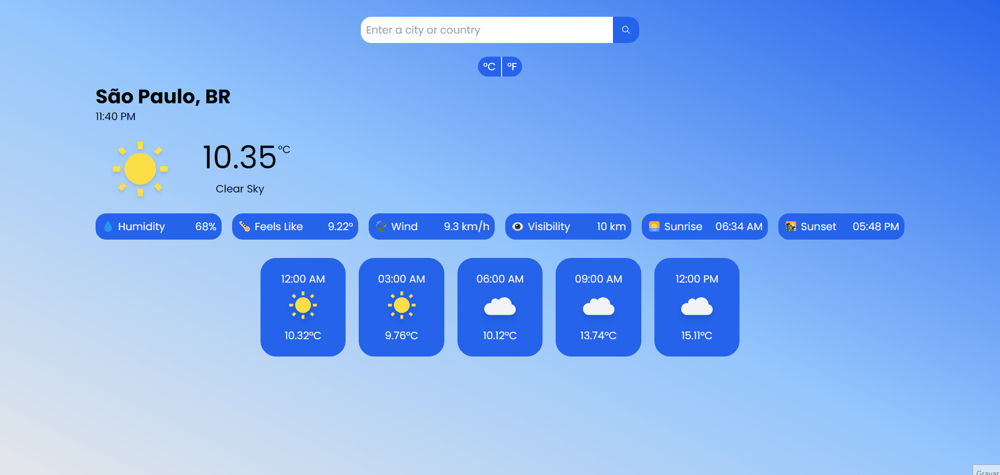

<h1 align='center'>Weather Web App</h1>
This app is able to search for a city, state/region, or country and exhibit the current weather data, forecast in a 3-hour gap and toggle between Celsius and Fahrenheit. Developed with React.js and Tailwind CSS using OpenWeather API.

## Access the Application 🌍
[Weather Web App](https://weather-web-app-black-three.vercel.app/)

## Mobile Version 📱


## Desktop Version 🖳


## Functionalities ☑️
- Mobile first development with Tailwind CSS;
- Location search input;
- Carousel at mobile version;
- See more/See less weather features at mobile version;
- Toggler between metric/imperial units system;
- Display local time;
- Page loader;
- Search loader;
- Error triggering if entered location does not exist

## Used Technologies ⚙️
- **React JS**: JavaScript library for building user interfaces.
- **Tailwind CSS**: Utility-first CSS framework for rapid styling and responsive design.
- **Axios**: HTTP client library used to fetch data from the OpenWeather API.
- **OpenWeather API**: Real-time weather data service used to provide climate and forecast information.

## How to Run the Project
### Requirements 🚀
- Node.js installed
- npm or yarn package manager

### Steps
1. Clone the repository:

   ```bash
   git clone https://github.com/Arpit501/weather_app_assignment.git
2. Install dependencies:

   ```bash
   cd weather-web-app
   npm install
3. Create a .env file in the project root and add your OpenWeather API key:

   ```
   REACT_APP_API_KEY='YOUR_KEY_HERE'
4. Run the project locally:

   ```
   npm start
5. Access the application at http://localhost:3000.
